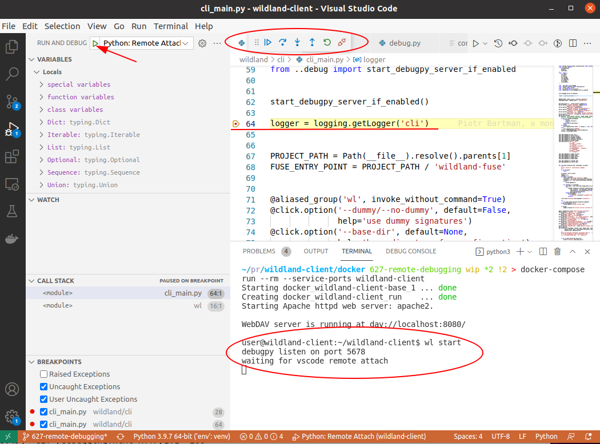
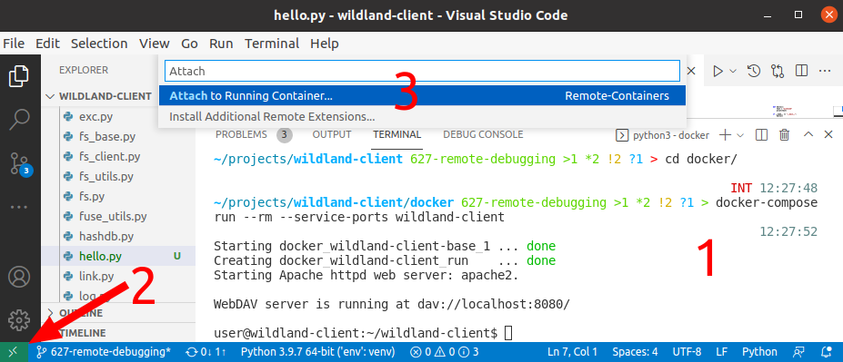
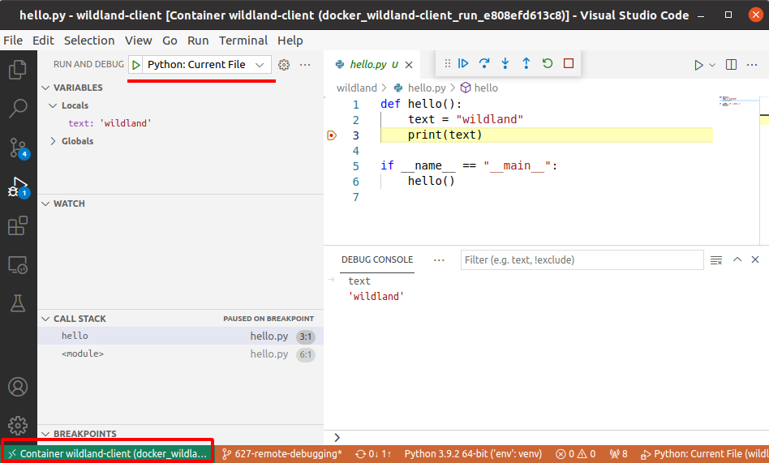

Debugging
=========

How to configure IDE Visual Code Studio to open project with properly configured Python debugger.

Needed extensions
-----------------
- Docker (`ext install ms-azuretools.vscode-docker`)
- Python (`ext install ms-python.python`)
- Remote Containers (`ext install ms-vscode-remote.remote-containers`)

Method 1: Python: Remote Attach
-------------------------------
Using debugpy server from the inside of docker container.

1. Configure your `.vscode/launch.json` -- see `.vscode.example`
2. Set env vars in `docker/debug.yml`

.. code-block:: yaml

  serivce:
    wildland-client:
      environment:
        DEBUGPY: "True"
        DEBUGPY__WAIT: "True"
      ports:
      - "5678:5678" # debugpy listener port

You can change values later from the docker inside

.. code-block:: bash

  user@wildland-client:~/wildland-client$ export DEBUGPY__WAIT=True

3. Start with container in another terminal

.. code-block:: sh

    cd docker
    docker-compose -f docker-compose.yml -f debug.yml run --rm --service-ports wildland-client

4. Set some brakepoints
5. Run wl command
6. Start debugger in vscode  

  Run and Debug -> Run Python: Remote Attach

Voilà !
    

Method 2: Attach to Running Container
-------------------------------------

1. Classic start with container in another terminal

.. code-block:: sh

    cd docker
    docker-compose -f docker-compose.yml -f debug.yml run --rm --service-ports wildland-client

2. Open a new vscode window inside docker container

3. Start debugger in vscode

  Run and Debug -> Run Python: Current File

Voilà !

