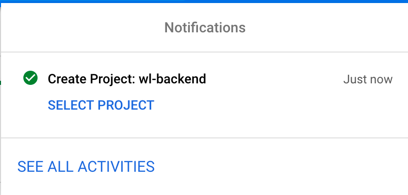

# Google Drive plugin

Google Drive based read/write storage backend for Wildland containers.

### Obtaining user credentials

1. Create new project on developer console via: https://console.cloud.google.com/projectcreate
<br/>

<br/>
<br/>
2. Select "SELECT PROJECT"
<br/>

<br/>
<br/>
3. On project page, select “Go to APIs overview”
<br/>

<br/>
<br/>
4.Click “ENABLE APIS AND SERVICES”
<br/>

<br/>
<br/>
5.Search for “Google Drive API” and select it and press “Enable”
<br/>

<br/>
<br/>
6. When API is enabled, you will see a warning on the dashboard, says: “To use this API, you may need credentials. Click 'Create credentials' to get started.”. Click “CREATE CREDENTIALS” next to it.
<br/>

<br/>
<br/>
7. There will be a wizard asking for Credential Type. Select “Google Drive API” and “User Data” and press “NEXT”
<br/>

<br/>
<br/>
8. Second Wizard screen is “OAuth consent screen”, fill necessary parts and Click “SAVE AND CONTINUE”
<br/>

<br/>
<br/>
9. Third Wizard screen is “Scopes”,  skip this screen by simply pressing “SAVE AND CONTINUE”
<br/>
<br/>
10. Fourth screen is “OAuth Client ID”. Select Desktop App as “Application type” and “Name” field can remain as it is, click “CREATE” button after.
<br/>

<br/>
<br/>
11. In final screen, Google will show your Client ID and give an option to download application credentials as in JSON format, this is what we are looking for. Press “DOWNLOAD” to have it. We don’t need Client ID itself.
<br/>

<br/>
<br/>
This is an example of what you will find in downloaded file.
```json
{
  "installed": {
    "client_id": "{CLIENT_ID}.apps.googleusercontent.com",
    "project_id": "{PROJECT_ID}",
    "auth_uri": "https://accounts.google.com/o/oauth2/auth",
    "token_uri": "https://oauth2.googleapis.com/token",
    "auth_provider_x509_cert_url": "https://www.googleapis.com/oauth2/v1/certs",
    "client_secret": "{CLIENT_SECRET}",
    "redirect_uris": ["urn:ietf:wg:oauth:2.0:oob", "http://localhost"]
  }
}
```

(Formatted version for readability)

```json
{
  "installed": {
    "client_id": "{CLIENT_ID}.apps.googleusercontent.com",
    "project_id": "{PROJECT_ID}",
    "auth_uri": "https://accounts.google.com/o/oauth2/auth",
    "token_uri": "https://oauth2.googleapis.com/token",
    "auth_provider_x509_cert_url": "https://www.googleapis.com/oauth2/v1/certs",
    "client_secret": "{CLIENT_SECRET}",
    "redirect_uris": ["urn:ietf:wg:oauth:2.0:oob", "http://localhost"]
  }
}
```

12. After downloading the file, Press “OK”, this will return back you to project credentials page, select “OAuth consent screen” from side menu, under “Publishing status” section, press “PUBLISH APP” button, We’re done here.


<br/>

### Creating Google Drive storage

```bash
wl storage create googledrive --inline --container YOUR_CONTAINER_NAME --credentials 'CONTENT_OF_CLIENT_CONFIG_JSON_IN_BETWEEN_SINGLE_QUOTE'
```

### Mounting

```bash
wl start
wl c mount YOUR_CONTAINER_NAME
```

### Google Drive documentation

- Google Developer Console: console.developers.google.com/
- Google Drive Python API repository: https://github.com/googleapis/google-api-python-client
- Google Drive API documentation: https://developers.google.com/drive/api/v3/about-sdk

### Issues

- Tree caching will fail if user manipulates entries from any other Google Drive client
- Some of the methods needs to be rewritten since I haven't consider performance optimizations at this stage.
- Chown and chmod are not implemented, need research if possible
- Error handling is quite immature
