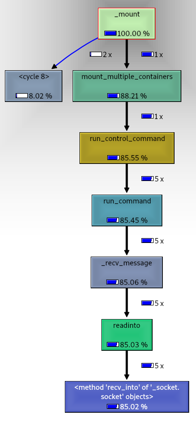
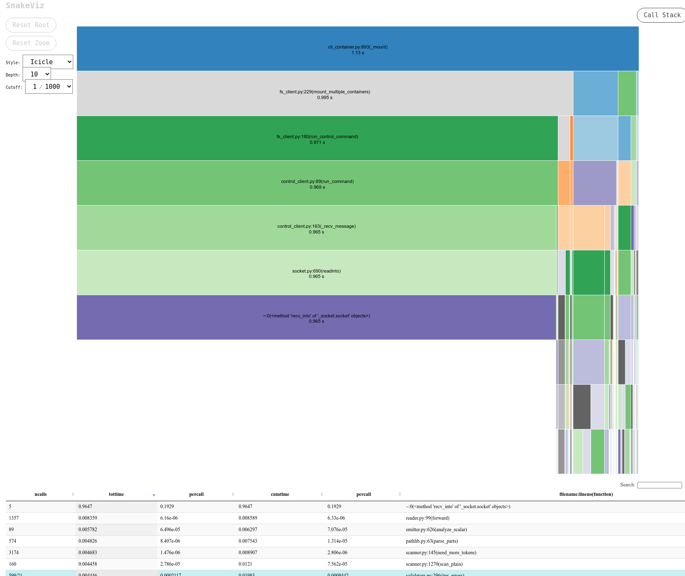
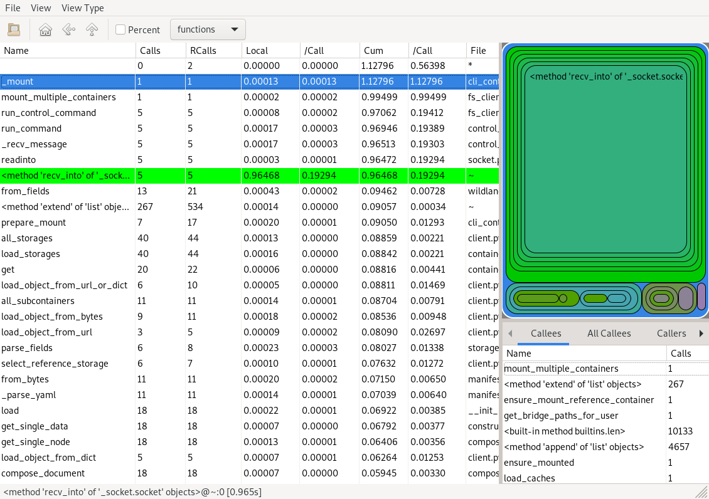

# Wildland performance profiling

To facilitate Wildland profiling, several profiling helper scripts have been prepared. Here is a
brief description of how to use them.


## `@profile` decorator

The `@profile()` decorator has been implemented to conveniently test Wildlands performance. You can
use it to label the functions you want to test for performance. It is safe to use the `@profile()`
decorator for functions called by another function labeled with `@profile()`.

For example, if you want to find out what the performance bottlenecks are when mounting Wildland,
you'll need to add the `@profile()` decorator to the `_mount` method. If you add it, and run
`./ci/ci-pytest`:

```console
$ docker-compose run --rm wildland-client-ci ./ci/ci-pytest -vvvv
```

you will get regular `pytest` output along with test reports created in the `artifacts` directory
for each of the tests that called the `_mount` function:

```console
$ tree -a ./artifacts/
# (...)
├── profiler_results
│   └── _mount
│       ├── test_books_titles_dir_tree
│       │   ├── wildland.cli.cli_container._mount.001.iprofile.html
│       │   ├── wildland.cli.cli_container._mount.001.iprofile.json
│       │   └── wildland.cli.cli_container._mount.001.iprofile.txt
│       ├── test_container_delete_umount
│       │   ├── wildland.cli.cli_container._mount.001.iprofile.html
│       │   ├── wildland.cli.cli_container._mount.001.iprofile.json
│       │   └── wildland.cli.cli_container._mount.001.iprofile.txt
│       ├── test_container_duplicate_mount
│       │   ├── wildland.cli.cli_container._mount.001.iprofile.html
│       │   ├── wildland.cli.cli_container._mount.001.iprofile.json
│       │   └── wildland.cli.cli_container._mount.001.iprofile.txt
│       ├── test_container_mount
│       │   ├── wildland.cli.cli_container._mount.001.iprofile.html
│       │   ├── wildland.cli.cli_container._mount.001.iprofile.json
│       │   ├── wildland.cli.cli_container._mount.001.iprofile.txt
│       │   ├── wildland.cli.cli_container._mount.002.iprofile.html
│       │   ├── wildland.cli.cli_container._mount.002.iprofile.json
│       │   └── wildland.cli.cli_container._mount.002.iprofile.txt
# (...)
│       ├── test_container_unmount_path_with_cache
│       │   ├── wildland.cli.cli_container._mount.001.iprofile.html
│       │   ├── wildland.cli.cli_container._mount.001.iprofile.json
│       │   └── wildland.cli.cli_container._mount.001.iprofile.txt
│       ├── test_multiple_storage_mount
│       │   ├── wildland.cli.cli_container._mount.001.iprofile.html
│       │   ├── wildland.cli.cli_container._mount.001.iprofile.json
│       │   ├── wildland.cli.cli_container._mount.001.iprofile.txt
│       │   ├── wildland.cli.cli_container._mount.002.iprofile.html
│       │   ├── wildland.cli.cli_container._mount.002.iprofile.json
│       │   └── wildland.cli.cli_container._mount.002.iprofile.txt
│       ├── test_storage_mount_remove_primary_and_remount
│       │   ├── wildland.cli.cli_container._mount.001.iprofile.html
│       │   ├── wildland.cli.cli_container._mount.001.iprofile.json
│       │   ├── wildland.cli.cli_container._mount.001.iprofile.txt
│       │   ├── wildland.cli.cli_container._mount.002.iprofile.html
│       │   ├── wildland.cli.cli_container._mount.002.iprofile.json
│       │   └── wildland.cli.cli_container._mount.002.iprofile.txt
│       └── test_storage_mount_remove_secondary_and_remount
│           ├── wildland.cli.cli_container._mount.001.iprofile.html
│           ├── wildland.cli.cli_container._mount.001.iprofile.json
│           ├── wildland.cli.cli_container._mount.001.iprofile.txt
│           ├── wildland.cli.cli_container._mount.002.iprofile.html
│           ├── wildland.cli.cli_container._mount.002.iprofile.json
│           └── wildland.cli.cli_container._mount.002.iprofile.txt
# (...)
```

Note that by default, each profiler report is saved in an HTML, JSON, and TXT file for convenience.
HTML probably offers the best UX because it is interactive and therefore recommended for humans.
Some tests have more than one report (`001`,` 002`, ... in the filename), indicating that `_mount`
was called multiple times.


## Customizing profiler

By default, the `@profile` decorator uses `pyinstrument`, which is a statistical Python profiler
that logs the call stack every few milliseconds, rather than logging the entire trace. This is done
to avoid the profiling overhead. If you want, you can replace `pyinstrument` with `cprofile` by
defining the `USE_CPROFILER_FOR_WILDLAND_PROFILING` environment variable.

```console
$ docker-compose run -e USE_CPROFILER_FOR_WILDLAND_PROFILING=1 --rm wildland-client-ci ./ci/ci-pytest -vvvv
$ tree -a ./artifacts/
# (...)
├── profiler_results
│   └── _mount
│       ├── test_books_titles_dir_tree
│       │   └── wildland.cli.cli_container._mount.001.cprofile
│       ├── test_container_delete_umount
│       │   └── wildland.cli.cli_container._mount.001.cprofile
│       ├── test_container_duplicate_mount
│       │   └── wildland.cli.cli_container._mount.001.cprofile
│       ├── test_container_mount
│       │   ├── wildland.cli.cli_container._mount.001.cprofile
│       │   └── wildland.cli.cli_container._mount.002.cprofile
# (...)
│       ├── test_container_unmount_path_with_cache
│       │   └── wildland.cli.cli_container._mount.001.cprofile
│       ├── test_multiple_storage_mount
│       │   ├── wildland.cli.cli_container._mount.001.cprofile
│       │   └── wildland.cli.cli_container._mount.002.cprofile
│       ├── test_storage_mount_remove_primary_and_remount
│       │   ├── wildland.cli.cli_container._mount.001.cprofile
│       │   └── wildland.cli.cli_container._mount.002.cprofile
│       └── test_storage_mount_remove_secondary_and_remount
│           ├── wildland.cli.cli_container._mount.001.cprofile
│           └── wildland.cli.cli_container._mount.002.cprofile
# (...)
```

If you want to print statistics on `stdout` in addition to created files, use` @profile(print_stats=True)`.


## Viewing profiling results

The HTML output generated by `pyinstrument` is human readable and provides a convenient way to view
the collected statistics. On the other hand, `cprofile`'s output files are dumped into the
[`pstats`][pstats] binary format, therefore a dedicated tool is needed to view the collected
statistics. There are many interactive tools you can work with to visualize `*.cprofile` files, one
of them are [snakeviz][snakeviz], [kcachegrind][kcachegrind] and [runsnakerun][runsnakerun]. These
tools offer an even more advanced way to navigate through the collected statistics than the
`pyinstrument` plain HTML file.

[pstats]: https://docs.python.org/3/library/profile.html#module-pstats
[snakeviz]: https://jiffyclub.github.io/snakeviz/
[kcachegrind]: http://kcachegrind.sourceforge.net/html/Home.html
[runsnakerun]: http://www.vrplumber.com/programming/runsnakerun/


### `kcachegrind`

To open the statistics produced by `cprofile` in `kcachegrind`, you must first convert them with
`pyprof2calltree` to a format accepted by `kcachegrind`.

If you are using Linux, you can install both tools from your standard repository. For Debian based
distributions run:

```console
# apt install pyprof2calltree kcachegrind
$ pyprof2calltree -i ./artifacts/profiler_results/_mount/test_books_titles_dir_tree/wildland.cli.cli_container._mount.001.cprofile
```

Once convertion is done, you can visualize the call stack with `kcachegrind`:

```console
$ kcachegrind ./wildland.cli.cli_container._mount.001.cprofile.log
```




### `snakeviz`

To open statistics generated by `cprofile` in `snakeviz`, which is a browser-based graphical viewer, run:

```console
$ pip install snakeviz
$ snakeviz ./artifacts/profiler_results/_mount/test_books_titles_dir_tree/wildland.cli.cli_container._mount.001.cprofile
```




### `runsnakerun`

To open statistics generated by `cprofile` in `runsnakerun`, run:

```console
$ apt install runsnakerun  # or: pip install runsnakerun
$ runsnake ./artifacts/profiler_results/_mount/test_books_titles_dir_tree/wildland.cli.cli_container._mount.001.cprofile
```




### Comparing `pyinstrument` output files

To make sure that each commit merged into Wildland's `master` branch doesn't degrade performance, a
tool was implemented that creates a diff-tree between two `pyinstrument` JSON output files and
displays the difference between the statistics for the respective functions. One of the files
corresponds to the profiling of the `origin/master` branch and the other to the branch that is
intended to be merged into `origin/master`. If the performance drops by more than the specified
threshold, the test will fail.

```console
$ python3 -m profiling.pyinstrument_diff_printer ./artifacts/profiler_results/_mount/test_multiple_storage_mount/wildland.cli.cli_container._mount.001.iprofile.json{.old,.new}
Performance test passed (max acceptable drop: 5.0 %, is: 0.35308240943435987 %).

Function calls stats diff:

function name                                                              cum_time diff   cum_time diff %     tot_time diff   tot_time diff %         fun_state
└── _run_profiler                                                            +0.0001 sec        +0.35308 %          +0.0 sec            +0.0 %      State.COMMON
    └── _mount                                                               +0.0001 sec        +0.35432 %          +0.0 sec            +0.0 %      State.COMMON
        ├── ensure_mount_reference_container                                 +0.0001 sec        +0.71592 %   +1.7347e-18 sec            +nan %      State.COMMON
        │   ├── iter                                                            +nan sec            +nan %          +nan sec            +nan %         State.OLD
        │   ├── open_node                                                    +0.0001 sec         +6.2461 %          +0.0 sec            +nan %      State.COMMON
        │   │   └── all_storages                                             +0.0001 sec         +6.2461 %          +0.0 sec            +nan %      State.COMMON
        │   │       └── load_storages                                        +0.0001 sec         +6.2461 %       +0.0001 sec         +6.2461 %      State.COMMON
        │   └── iter2                                                           +nan sec            +nan %          +nan sec            +nan %         State.NEW
        ├── prepare_mount                                                       +0.0 sec            +0.0 %          +0.0 sec            +0.0 %      State.COMMON
        │   └── all_subcontainers                                               +0.0 sec            +0.0 %          +0.0 sec            +0.0 %      State.COMMON
        │       └── from_params                                                 +0.0 sec            +0.0 %          +0.0 sec            +0.0 %      State.COMMON
        │           └── __init__                                                +0.0 sec            +0.0 %          +0.0 sec            +0.0 %      State.COMMON
        ├── mount_multiple_containers                                           +0.0 sec            +0.0 %          +0.0 sec            +nan %      State.COMMON
        │   ├── _generate_command_for_mount_pseudomanifest_container            +0.0 sec            +0.0 %          +0.0 sec            +nan %      State.COMMON
        │   │   └── _get_commands_for_mount_containers                          +0.0 sec            +0.0 %          +0.0 sec            +0.0 %      State.COMMON
        │   └── _generate_command_for_mount_container                           +0.0 sec            +0.0 %          +0.0 sec            +nan %      State.COMMON
        │       └── _get_commands_for_mount_containers                          +0.0 sec            +0.0 %          +0.0 sec            +nan %      State.COMMON
        │           └── <listcomp>                                              +0.0 sec            +0.0 %          +0.0 sec            +0.0 %      State.COMMON
        │               └── get_command_for_mount_container                     +0.0 sec            +0.0 %          +0.0 sec            +0.0 %      State.COMMON
        │                   └── get_storage_mount_paths                         +0.0 sec            +0.0 %          +0.0 sec            +0.0 %      State.COMMON
        │                       └── <listcomp>                                  +0.0 sec            +0.0 %          +0.0 sec            +0.0 %      State.COMMON
        └── get_bridge_paths_for_user                                           +0.0 sec            +0.0 %          +0.0 sec            +nan %      State.COMMON
            └── load_object_from_name                                           +0.0 sec            +0.0 %          +0.0 sec            +0.0 %      State.COMMON

```

The diff tool is capable of limiting tree depth, printing diff in stats, filtering out functions
present in just one of the trees (see: `fun_state` column) and coloring time diffs exceeding given
threshold (5% by default).


[^pyinstrument-diff]: The tool does not support `cprofile` output files, but the implementation is
intended to be generic enough to allow extendability for other profilers such as `cProfile`.
